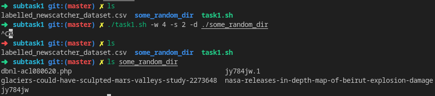
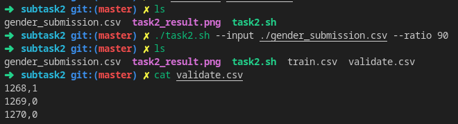

# Task 2 instructions

Here presented quick testing instructions and expected results.

# Subtask 1

To check:
```bash
cd subtask1
```
Download dataset from [Google Drive](https://drive.google.com/file/d/1EfRc2RLVdwWlXWz3nDIBEv_EvvOMd9ip/view?usp=sharing) and move it to current folder.<br>
Then run:
```bash
./task1.sh -w 4 -s 2 -d ./some_random_dir
```
The output should look like this:


# Subtask 2

To check:
```bash
cd subtask2
```
Download some dataset from [Kaggle](https://www.kaggle.com/c/titanic/data?select=gender_submission.csv) and move it to current folder.
Then run:
```bash
/task2.sh --input ./gender_submission.csv --ratio 90
```
The output  should look like this:
